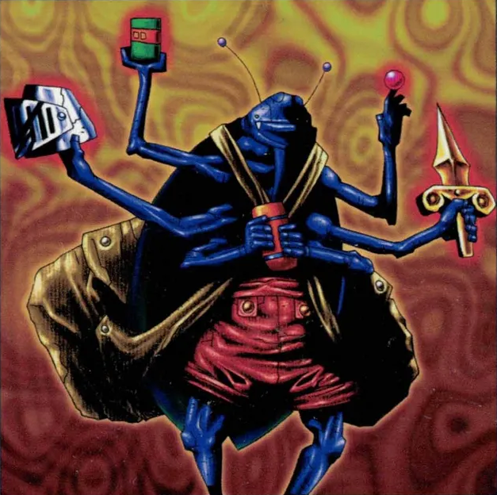

# Magical Merchant
A web-based retain point of sale app that allows small businesses to operate a cash register anywhere without any extra hardware - only requires a phone and a Stripe account if you want to take payments by card, Apple pay, etc.

I got the idea to build it from seeing vendors having either limited POS options or having to go out of the way to bring equipment from their store when selling at game tournaments, anime conventions, and other events. But, you could use this app at farmers markets, food trucks, in a store, or anywhere!

**Link to project:** https://magical-merchant.cyclic.app
Live version with demo account available on Render
Demo Account: demo@demo.demo 
Demo Password: magical-merchant-demo

## How It's Made:

**Tech used:** HTML, EJS, CSS, Bootstrap, JavaScript, Node.js, Express, MongoDB, Mongoose

Using the Stripe API for card payments, Algolia Autocomplete for database searching and autocomplete on the front end, Big.js to handle floating point math and QRcode-svg to convert Stripe Payment Links to SVG.

## Optimizations
Features I want to add in the future:
* Edit/Delete products from the items database directly in the POS.
* Order history and suspend transaction functionality & pages using the current POS page.
* Ability to upload bulk data to the items database. 
* Interfacing with mobile phone's camera to provide UPC/other code scanning functionality and/or using an API for product recognition.
   * Additional setting to ignore certain kinds of codes when scanning (ex. only scan UPCs and ignore stray QR codes on the product when ringing a transaction)
* Further integration with Stripe API to allow for refunds and more details included in the generated products/prices.
* Convert Frontend to a framework like React and reduce instances where the page is refreshing.

## Lessons Learned:
How to integrate multiple remote APIs with my own to provide necessary functionality without having to code everything myself.

How to budget time between multiple projects to hit all necessary deadlines between them.

My previous work experience can be used as a knowledge base to build a better product.

## Example:
Live version with demo account available on cyclic.sh:
https://magical-merchant.cyclic.app
Demo Account: demo@demo.demo 
Demo Password: magical-merchant-demo
