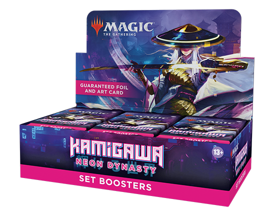

# Magical Merchant
A web-based retail point of sale system for local game stores and other small businesses, designed with mobile in mind so you can use the same POS in-store and at tournaments, conventions, and other events.

**Link to project:** https://anitanotto.github.io/magical-merchant/

## How It's Made:

**Tech used:** HTML, CSS, JavaScript, Node.js, MongoDB

After years of working in retail, I want to build a POS that is easy to use but still has all the essentials, plus more powerful features for those who want to use them. 

## Optimizations
Ideal features to add in the future :
* Search, add, and edit items in the product database right from the POS, even during a transaction if necessary.
* Ability to interface with mobile phone cameras for UPC scanning and payment peripherals for the ability to run POS 100% off of mobile devices.
  * Use of Azure Cognitive Services API for single card and/or product recognition.
   * Additional setting to ignore certain kinds of codes when scanning (ex. only scan UPCs and ignore stray QR codes on the product when ringing a transaction)
* QR code-based system for customer receipts and/or store loyalty program to help your business go paperless.
* Integration with TCGplayer API for pricing & inventory.

## Lessons Learned:

My previous work experience can be used as a knowledge base to build a better product.

## Example:
**Current Wireframe:** https://anitanotto.github.io/magical-merchant/
